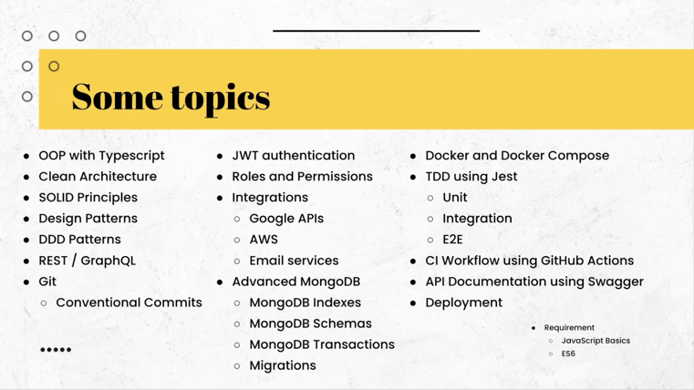

### Guide create project nodejs with clean architecture

[Guide video]: (https://www.youtube.com/watch?v=WZpLJ6jLyw8&list=PLN3ZW2QI7gLfQ4oEkDWw0DZVIjvAjO140&index=3)
[Nâng cao chất lượng code và hiệu quả làm việc nhóm với Husky, Lint-Staged, CommitLint]: (https://viblo.asia/p/nang-cao-chat-luong-code-va-hieu-qua-lam-viec-nhom-voi-husky-lint-staged-commitlint-4dbZNnMnZYM)

# Using husky & lint-staged & comventional-changelog
https://github.com/conventional-changelog/commitlint

# start dev
    `npm run build:watch`
    `npm run dev`
